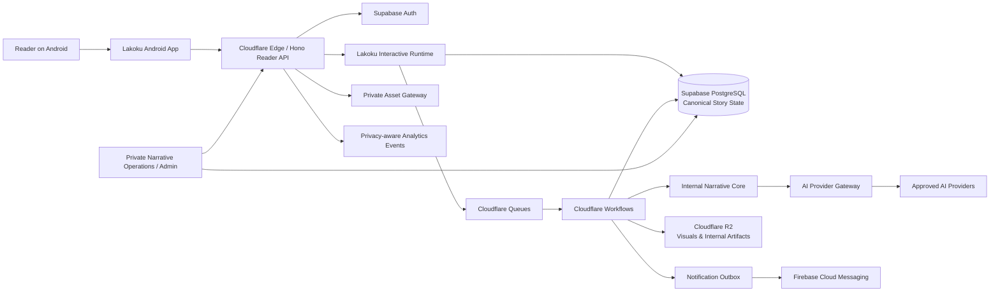
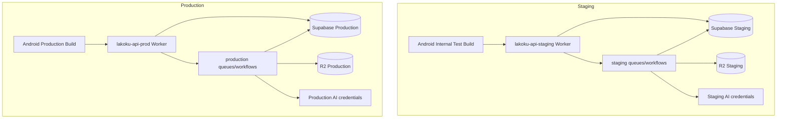
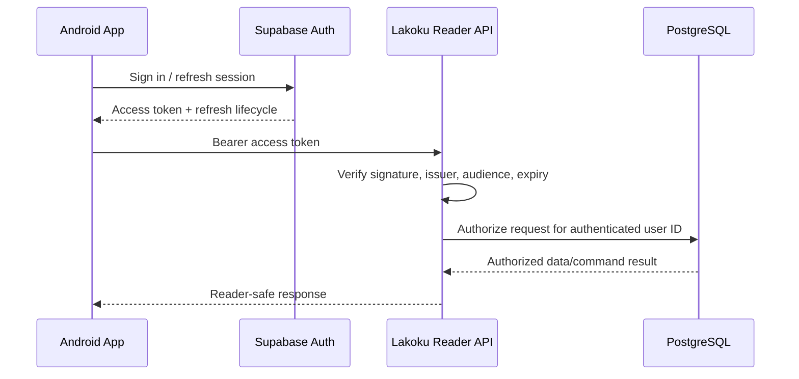
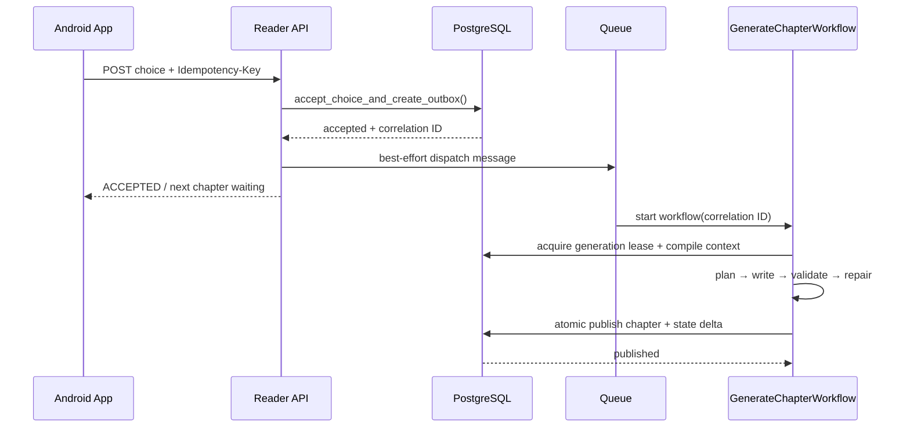

# Lakoku — System Architecture

**Version:** 1.1  
**Status:** Build-ready technical baseline  
**Last updated:** 5 July 2026  
**Amendments applied:** AMENDMENTS v0.3 (§B), AMENDMENTS v0.4 (§B) — see `docs/AMENDMENTS_v0.3.md`, `docs/AMENDMENTS_v0.4.md`  
**Primary release:** Private Beta — web reader mobile-first first, Android (Kotlin) second  
**Client sequencing:** Web reader (Next.js) is the first production client; Android native follows once web retention/monetization is proven — see AMENDMENTS v0.4 §0 (LD-CLIENT-SEQ)  
**Primary app stack:** Web reader — Next.js (App Router); Android — Kotlin + Jetpack Compose (second client)  
**Backend stack:** TypeScript + Hono on Cloudflare Workers, Cloudflare Queues/Workflows, Supabase PostgreSQL  
**Canonical product documents:** `docs/PRD_Lakoku_Interactive_v0.3.md`, `LAKOKU_BRAND_GUIDELINES_v1.1.md`  
**Normative narrative-consistency spec:** `docs/NARRATIVE_CONSISTENCY_SPEC.md` (NCS v1.0). For long-form 50-chapter consistency, NCS governs; this document must not contradict it. See also `docs/NARRATIVE_TRACEABILITY_MATRIX.md`.

---

## 1. Purpose and Scope

This document defines the implementation architecture for Lakoku: a mobile-first interactive novel platform where the reader becomes the protagonist.

It turns the product contract into build boundaries for:

- Android application architecture;
- Reader API and backend runtime;
- story canon, choice, and generation state;
- durable chapter-generation workflows;
- database, object storage, authentication, and entitlement boundaries;
- privacy, security, observability, and delivery;
- repository structure and engineering rules.

This is an **architecture document**, not a screen specification or complete database schema. The PRD remains the source of truth for product behavior, narrative requirements, feature scope, and reader-facing copy. The Brand Guidelines override this document whenever a public-facing term, visual, or communication rule conflicts.

### 1.1 Architecture principles

1. **Reader-first, not AI-first.** The app renders a premium reading experience. AI generation is server-side infrastructure and never appears as a consumer-facing concept.
2. **Mobile-first, web client first.** The reading experience is optimized for vertical touch screens. The **web reader (Next.js) is the first production client**; Android native (Kotlin/Jetpack Compose) follows as a second client once web metrics are proven. See AMENDMENTS v0.4 (LD-CLIENT-SEQ). Both clients obey the same brand and boundary rules.
3. **Canonical state beats generated prose.** PostgreSQL records—not LLM output, chat history, or semantic search—are the source of truth for facts, choices, timelines, secrets, relationships, and ending gates.
4. **Bounded branching.** The story spine is controlled; choices change state, scenes, routes, and endings without creating unbounded parallel novels.
5. **Durable asynchronous generation.** A reader request must never hold open while a model writes a chapter. Generation uses queue-driven, resumable workflows with idempotency and retry control.
6. **Privacy by default.** Stories are private, the app does not need a reader's real identity in prose, and no client receives provider keys or internal prompts.
7. **Modular monolith before microservices.** The first backend deploys as one logical API/runtime codebase with strict modules. Separate services are added only when independent scaling or security requires them.
8. **Every state transition is attributable.** Important mutations carry an actor, correlation ID, event ID, and durable audit trail.
9. **Safe failure is preferable to incorrect fiction.** A failed chapter waits and retries; it must never publish a continuity-critical invalid draft merely to appear responsive.
10. **Brand separation is enforceable.** Narraza may be named only in private engineering and narrative-operations materials. It must never surface in the reader app, public API payloads, marketing, notifications, or reader errors.

---

## 2. Locked Technology Decisions

| Area | Decision | Reason |
|---|---|---|
| Mobile client | Kotlin + Jetpack Compose | Android-first reader needs native scroll behavior, durable local cache, system text scaling, background retry, and a polished reading surface. |
| Android pattern | Repository + unidirectional data flow + ViewModel | Clear state ownership, testability, and lifecycle-safe Compose screens. |
| Local data | Room + DataStore | Published chapters and progress are locally readable; preferences are durable and small. |
| API edge | Hono on Cloudflare Workers | Low-ops TypeScript API layer compatible with existing Cloudflare-oriented infrastructure. |
| Durable jobs | Cloudflare Queues + Cloudflare Workflows | Queues decouple post-commit work; Workflows orchestrate retriable, multi-step chapter generation. |
| Canonical database | Supabase PostgreSQL | Relational canon/state, transactions, JSONB, full-text search, pgvector where appropriate, Auth integration, and RLS defense in depth. |
| Authentication | Supabase Auth | Email/password initially, short-lived access tokens, server-side JWT verification, and a future OAuth path. |
| Object storage | Cloudflare R2 private bucket | Covers, scene images, and internal generation artifacts stay outside the primary database; access is mediated by API rules. |
| AI integration | Server-side provider gateway | Provider/model routing, schema validation, cost controls, and fallbacks stay private and replaceable. |
| Observability | Structured logs + Sentry-compatible error monitoring + database audit tables | Correlates app request, choice, queue event, workflow, model call, validation, and publish result without logging private prose broadly. |
| API contract | Versioned OpenAPI + JSON Schema/Zod contracts | Android and backend integrations are explicit, validated, and regression-testable. |
| Deployment model | Separate staging and production environments | No shared credentials, queues, databases, storage, auth settings, or billing webhooks across environments. |

### 2.1 Explicitly not selected for v1

- React Native: not selected — the cross-platform native wrapper adds a JavaScript/native integration boundary without solving a current product problem. This does **not** apply to the web reader (Next.js), which is the first production client per AMENDMENTS v0.4.
- Flutter: viable later if iOS becomes a near-term commercial requirement; not selected while web-first validation and (later) native Android reader quality matter more.
- Direct Android-to-LLM calls: forbidden.
- Direct Android access to narrative tables: forbidden.
- Kubernetes, multi-region microservices, Kafka, or event-sourcing infrastructure: premature for private beta.
- Runtime freeform roleplay chat: excluded until the canonical narrative runtime is stable.

---

## 3. System Context



### 3.1 Boundary definition

| Boundary | Responsibility | Must not do |
|---|---|---|
| Web reader app (first client) | Render UI, cache published reader data, collect choices, persist local progress, call the Reader API — via a single async client-data seam (`lib/api/`) | Call AI providers, mutate canon directly, determine entitlement, expose secrets, or let UI components depend on the data source directly. |
| Android app (second client) | Render UI, cache published reader data, collect choices, persist local progress, call the Reader API | Call AI providers, mutate canon directly, determine entitlement, expose secrets. |
| Reader API / BFF | Authenticate, authorize, validate input, shape app responses, invoke transactional runtime commands | Generate a chapter synchronously inside the HTTP request. |
| Interactive Runtime | Story lifecycle, choice acceptance, entitlement checks, outbox creation, status transitions, atomic publish commands | Let generated text commit canon directly. |
| Internal Narrative Core | Context compilation, planner/writer contracts, canon/reveal checks, validation and repair logic | Become a reader-facing brand or UI concept. |
| AI Provider Gateway | Model routing, structured generation, timeout/retry classification, cost accounting, provider isolation | Trust client model parameters or allow raw output to publish automatically. |
| PostgreSQL | Canonical story state, event ledger, relational authorization, transactional commands | Store unrestricted binaries or serve as a public reader CDN. |
| Queues / Workflows | Reliable asynchronous handoff and durable multi-step orchestration | Be the source of truth for story state. |
| R2 asset storage | Covers, scene visuals, private diagnostic artifacts | Decide user authorization or canonical story state. |
| Operations console | Template, QA, reports, and controlled remediation | Share raw reader data with Narraza author workspaces by default. |

---

## 4. Deployment Topology

### 4.1 Environment topology



### 4.2 Environment rules

- Staging and production use separate Supabase projects, Cloudflare bindings, R2 buckets, Auth settings, payment credentials, FCM credentials, provider credentials, and error-monitoring projects.
- Production data must never be copied into staging without an approved anonymization procedure.
- Android internal testing points only to staging; release candidates point to production only after approval.
- Worker bindings and secret names are environment-scoped. Source code must not infer an environment from URL strings.
- Every database migration runs on staging first, has a matching rollback/forward plan, and is applied through CI or an audited deployment command.

### 4.3 Cloudflare runtime roles

| Runtime | Trigger | Role |
|---|---|---|
| `lakoku-api` Worker | HTTP requests from Android/admin | Auth, reader endpoints, choice acceptance, progress sync, signed asset issuance, admin commands. |
| `generation-dispatch` consumer | Queue messages + outbox sweeper | Starts an idempotent chapter workflow after a committed database outbox event. |
| `GenerateChapterWorkflow` | Workflow instance | Planner → writer → validator → repair → atomic publish pipeline. |
| `outbox-sweeper` scheduled Worker | Cron | Re-enqueues unsent or lease-expired outbox records. |
| `notification-dispatch` consumer | Queue message | Sends safe, spoiler-free push notifications after a valid product event. |
| `analytics-dispatch` consumer | Queue message | Sends privacy-filtered events to the analytics destination and writes operational aggregates. |

Queues are used for decoupled handoff and backpressure; Workflows are used for the chapter-generation process because it has ordered steps, state, retry, and failure recovery. Cloudflare documents Workflows as durable multi-step execution with persisted state and retries, and Queues as a reliable worker-integrated buffer for asynchronous delivery. See [Cloudflare Workflows](https://developers.cloudflare.com/workflows/) and [Cloudflare Queues](https://developers.cloudflare.com/queues/).

---

## 5. Repository Structure

Use a single product monorepo while the product is in private beta. It keeps API contracts, narrative fixtures, migrations, and Android integration changes in one reviewable change set.

```text
lakoku/
├── apps/
│   ├── android/                         # Kotlin/Gradle Android application
│   │   ├── app/
│   │   ├── core/
│   │   ├── feature/
│   │   ├── build-logic/
│   │   └── gradle/
│   ├── api/                             # Hono Worker / Reader API
│   └── admin/                           # private operations UI, later if needed
├── packages/
│   ├── contracts/                       # OpenAPI, JSON Schema, Zod, generated types
│   ├── runtime/                         # story lifecycle, choice and state commands
│   ├── narrative-core/                  # internal canonical story logic
│   ├── ai-gateway/                      # provider adapters and structured outputs
│   ├── db/                              # migrations, RPCs, repositories, fixtures
│   ├── analytics/                       # event taxonomy and sanitizers
│   └── config/                          # typed environment configuration
├── infra/
│   ├── cloudflare/                      # wrangler configs, queue/workflow bindings
│   ├── supabase/                        # config, SQL migrations, seed data
│   └── ci/                              # release scripts and checks
├── docs/
│   ├── ARCHITECTURE.md
│   ├── DATABASE.md
│   ├── API.md
│   ├── SECURITY.md
│   ├── NARRATIVE_CORE.md
│   ├── PROMPT_CONTRACTS.md
│   ├── TESTING.md
│   └── DEPLOYMENT.md
├── fixtures/
│   ├── narrative/
│   └── api/
├── .github/workflows/
├── AGENT_RULES.md
└── README.md
```

### 5.1 Package ownership rules

- `packages/contracts` is the only shared definition of externally visible API schemas. Hand-written duplicate request/response types are prohibited.
- `packages/runtime` owns story state commands. API route handlers may call runtime commands but may not reimplement their transaction logic.
- `packages/narrative-core` owns context, canon checks, planners, validators, and repair constraints. It may not import HTTP request objects or Android concepts.
- `packages/ai-gateway` owns provider-specific code. Other packages refer only to internal task contracts such as `generatePlan()` and `writeChapter()`.
- `packages/db` owns migrations and database-facing repositories/RPC invocations. It is the only package permitted to create SQL command text.
- `apps/android` never contains provider key, SQL, story-canon mutation logic, or hard-coded commercial entitlement policy.

---

## 6. Android Application Architecture

### 6.1 Design pattern

The Android app uses a layered, offline-capable architecture:

```text
Compose UI
  → ViewModel / UI State
  → Use Cases where complexity justifies them
  → Repository
  → Local Data Source (Room / DataStore)
  → Remote Data Source (Lakoku Reader API)
```

The UI observes immutable state from a ViewModel. User actions enter as events. Repositories reconcile local and remote data. The reader renders from local data wherever a published chapter is available.

This follows Android guidance for a data layer that combines local and network sources and enables critical reading behavior without continuous connectivity. See [Android offline-first data layer guidance](https://developer.android.com/topic/architecture/data-layer/offline-first) and [Android architecture recommendations](https://developer.android.com/topic/architecture/recommendations).

### 6.2 Android Gradle modules

```text
apps/android/
├── app                              # app entry point, navigation graph, DI composition
├── core/
│   ├── common                        # Result types, clocks, IDs, dispatchers
│   ├── model                         # Stable domain/UI models with no Android dependency
│   ├── designsystem                  # Lakoku tokens, components, typography, accessibility
│   ├── network                       # API client, auth interceptor, DTOs, error mapping
│   ├── database                      # Room entities, DAOs, migrations
│   ├── data                          # repositories and local/remote reconciliation
│   ├── datastore                     # reader and app preferences
│   ├── notifications                 # FCM routing and safe deep links
│   └── testing                       # fakes, fixtures, test utilities
└── feature/
    ├── auth
    ├── onboarding
    ├── library
    ├── storyfoundation
    ├── reader
    ├── access
    ├── ending
    ├── profile
    └── report
```

Do not create a Gradle module for every isolated component. A new module requires a stable ownership boundary, independent test value, or dependency-control benefit.

### 6.3 Android state rules

| Concern | Rule |
|---|---|
| Screen state | Each screen has one immutable `UiState` emitted by its ViewModel. |
| One-off UI events | Navigation, snackbars, and dialogs use an explicit event channel/state—not mutable UI callbacks. |
| Reader text | Store published chapter content in Room; never rely only on a Compose in-memory state. |
| Scroll position | Persist debounced anchors locally; sync to API opportunistically. |
| Choices | Persist a `PendingChoice` with a UUID idempotency key before the network submission begins. |
| Progress | Local progress is immediate; server progress is best-effort and retryable. |
| Settings | Text size, line spacing, reader theme, reduce motion, and content preferences use DataStore. |
| Account session | Auth library/session handling is isolated behind an `AuthRepository`; screens never parse JWTs. |

### 6.4 Local persistence model

| Room entity | Purpose | Retention |
|---|---|---|
| `CachedStoryEntity` | Library metadata, title, cover, status, current chapter | Until refreshed/deleted/account removal |
| `CachedChapterEntity` | Published chapter body, title, version, checksum, read state | Until story deletion, replacement by new approved version, or storage cleanup |
| `CachedChoiceEntity` | Presented choice and option labels for a published chapter | Tied to cached chapter |
| `ReadingProgressEntity` | Chapter, anchor, completion time, local sync sequence | Last state per story |
| `PendingChoiceEntity` | Option, story/chapter/choice IDs, idempotency key, submission state | Removed only after server acceptance or user-visible terminal recovery |
| `SyncTaskEntity` | Durable retry metadata for progress/report requests | Short retention after success |

`DataStore` holds only small user preferences and non-sensitive local app configuration. It must not hold chapter prose, canonical state, access tokens in custom plaintext fields, provider configuration, or entitlement authority.

### 6.5 Offline and reconnect behavior

| Scenario | App behavior |
|---|---|
| User opens a cached published chapter offline | Open immediately; reading works normally. |
| User reaches a primary choice offline | Save selected option only after confirmation; show that the decision is waiting for connection; do not offer a second primary selection. |
| Network returns after a pending choice | WorkManager/repository retries with the same idempotency key. |
| Server reports choice already accepted | Mark pending choice accepted and refresh generation status. |
| Server rejects a stale/invalid choice | Preserve the selected option visually, display safe recovery copy, refresh the chapter, and never silently substitute another option. |
| User changes reader settings offline | Apply immediately and sync only when settings are server-owned. |
| New story creation offline | Disabled with calm, non-technical copy; no local speculative story instance. |
| Next chapter is unavailable | Reader shows a durable waiting state and polls/backoffs only while the screen is active or background work is eligible. |

### 6.6 Reader performance requirements

- Reader chapter content must be locally queryable and render without waiting for a network call when cached.
- Use stable paragraph keys and lazy rendering where chapter layout requires it; avoid reparsing all text on every scroll update.
- Text styling is derived from reader preferences, not persisted as duplicate chapter versions.
- Cover and scene image loading is lazy and failure-safe. A missing image cannot block prose rendering.
- All reader controls have accessible content descriptions and meet touch target requirements.
- Reader themes: Paper Cream light, Lakoku Ink dark, and compatible sepia. Display typography is never used for body prose.

---

## 7. Reader API / BFF Architecture

### 7.1 API role

The Reader API is the only public application backend surface, and it is **client-agnostic**: the web reader (first client) and the Android app (second client) consume the exact same contract. On each client, a single async client-data seam represents this contract — in the web app that seam is `lib/api/` (see AMENDMENTS v0.4, LD-CONTRACT-SEAM). It is responsible for:

- verifying user identity and session;
- enforcing ownership and entitlement;
- validating all input against schema;
- returning reader-safe DTOs;
- invoking runtime commands;
- issuing short-lived authorized asset URLs;
- handling safe status polling and error translation;
- forwarding privacy-filtered telemetry.

No client (web reader or Android app) queries narrative tables, invokes RPCs, calls AI providers, or sends model-related parameters.

### 7.2 API layers

```text
HTTP Route
  → Authentication middleware
  → Request schema validation
  → Authorization / entitlement policy
  → Runtime command or query handler
  → Response mapper
  → Structured audit and telemetry event
```

### 7.3 Endpoint family

| Area | Example endpoint | Notes |
|---|---|---|
| Bootstrap | `GET /v1/bootstrap` | Profile, app-safe configuration, feature flags, current entitlement summary. |
| Library | `GET /v1/stories` | Cursor-pagination, only owned stories, no future route/ending spoilers. |
| Reader | `GET /v1/stories/:id/chapters/:chapterNo` | Returns only published, authorized chapter content. Supports `ETag`. |
| Choice | `POST /v1/stories/:id/choices/:choiceId/select` | Requires idempotency key and current story ownership. Returns accepted/waiting state, not generated prose. |
| Status | `GET /v1/stories/:id/generation-status` | Returns reader-safe phase/status, retry availability, no model metadata. |
| Progress | `POST /v1/stories/:id/progress` | Monotonic update rules; best-effort from client. |
| Foundation | `/v1/story-architect/*` internally named; reader UI names it `Pilih Peranmu` | Conversation and proposal lifecycle. Never exposes internal prompt/config. |
| Access | `GET /v1/catalog/access-options`, `POST /v1/checkout/sessions` | Server-owned catalog and entitlement. |
| Reports | `POST /v1/stories/:id/report` | Attaches canonical references, not a user-provided screenshot requirement. |
| Asset access | `POST /v1/assets/:id/url` | Checks ownership/content permission before issuing URL. |

### 7.4 API versioning and compatibility

- All app APIs start with `/v1`.
- Additive response fields are allowed; breaking field changes require a new version or compatibility period.
- Mobile release code must tolerate unknown fields and feature flags.
- API fields must be expressed in public reader terminology. Do not expose `Narraza`, model IDs, token counts, raw prompts, RAG metadata, or canonical state implementation details.
- OpenAPI is the API contract source. Backend contract validation and Android client serialization tests run in CI.

### 7.5 Idempotency contract

Every request that can change durable state includes `Idempotency-Key`:

- primary choice submission;
- story contract lock;
- checkout creation;
- payment webhook processing;
- report submission when retryable;
- controlled admin remediation actions.

Rules:

1. The key is scoped to actor + operation + endpoint.
2. The request body hash is stored with the key.
3. Same key and same hash returns the original successful or accepted response.
4. Same key and different hash returns a safe conflict error.
5. Idempotency records are retained for a policy-defined period, long enough to cover mobile retry behavior and provider webhook retries.

---

## 8. Authentication, Authorization, and Entitlement

### 8.1 Authentication flow



### 8.2 Authorization model

- The API derives the authenticated `user_id` exclusively from verified server-side claims.
- Resource IDs supplied by clients are never trusted as proof of ownership.
- Every story query and command validates ownership through `story_instances.user_id` or a documented access relationship.
- Entitlements are evaluated server-side immediately before story creation, locked-content access, replay creation, or commercial commands.
- Admin access is separate from reader access. It requires a role/permission check, audited session, and additional operational protection such as Cloudflare Access for the internal console.

### 8.3 Database security posture

- Enable RLS on all reader-owned tables and any view exposed through Supabase APIs.
- Do not expose direct table access to the Android app; the BFF remains the normal access path.
- Use RLS as defense in depth against accidental exposure, support tooling mistakes, and future feature expansion.
- Backend database access uses a least-privilege server role/controlled RPC boundary. Service credentials remain only in Cloudflare secrets and are never logged or bundled into the app.
- SQL functions that coordinate story state have explicit permission, fixed `search_path`, schema-validated parameters, and audit fields.
- Security-definer functions are exceptional and must be reviewed; they must not become a generic bypass around ownership checks.

Supabase documents RLS as a Postgres control layer that can provide defense in depth and work with Supabase Auth. See [Supabase Row Level Security](https://supabase.com/docs/guides/database/postgres/row-level-security).

### 8.4 Entitlement authority

`entitlements` is server-authoritative. The app may cache display information but cannot grant itself:

- story creation rights;
- chapter access;
- replay access;
- paid feature access;
- payment completion status.

Payment provider events are verified, idempotent, recorded in `payment_events`, then passed through a single entitlement grant/revoke command. No mobile callback is sufficient to grant access.

---

## 9. Narrative Runtime Architecture

### 9.1 Story state hierarchy

```text
Product and template policy
  → Story Contract (locked version)
    → 50-chapter blueprint
      → Canon and state ledger
        → Current published chapter / choice state
          → Generated draft candidates and validator reports
```

### 9.2 Canonical sources of truth

| Domain | Canonical record | Derived/secondary record |
|---|---|---|
| Story premise and immutable foundation | `story_contracts` | Foundation-session messages, proposal text |
| Chapter path | `chapter_blueprints` | Planner output artifact |
| Character identity and motivation | `characters`, `character_states` | Prose descriptions |
| Facts and timeline | `facts_ledger`, `timeline_events` | Scene archive/vector retrieval |
| Secrets and reveal permissions | `secrets_reveals`, `knowledge_scopes` | Writer inference |
| Relationships and route gates | `relationship_states`, `story_flags`, `ending_rules` | Dialogue tone |
| Reader choice | `choice_responses`, `story_events` | Client local pending state |
| Published chapter | `story_chapters` with immutable version | Draft/repair artifacts |
| Generation history | `generation_attempts`, `generation_artifacts`, `validation_reports` | Application logs |
| Character aliases | `character_aliases` | Mentions in prose |
| Character voice profile | `character_voice_sheets` | Dialogue style in drafts |
| Memory rollup | `act_rollups` (T1) | Chapter summaries (T2) |

### 9.3 Event-sourced audit, not full event sourcing

Lakoku uses an **append-only event ledger plus derived relational state**:

- `story_events` records important facts such as contract locked, choice selected, chapter published, report filed, and admin repair.
- Derived tables store efficient current state for reader/API queries.
- Every derived state change links to a source event or generation attempt.
- The system does not attempt a pure replay-every-event architecture for beta. This avoids unnecessary complexity while preserving traceability.

### 9.4 State transition authority

| Transition | Sole authority |
|---|---|
| Story contract lock | Runtime database command after validated proposal/entitlement |
| Blueprint creation | Runtime + narrative core, saved before Chapter 1 opens |
| Choice acceptance | Transactional runtime command |
| Generation start | Workflow after durable outbox event |
| Fact/relationship/knowledge mutation | Atomic chapter publish command after validation |
| Chapter publish | Atomic publish transaction only |
| Ending unlock | Runtime rule evaluation during Chapter 50 publish |
| Admin repair | Explicit, audited remediation command with chapter version handling |

Generated text can propose state changes, but it cannot write state by itself.

---

## 10. Choice Acceptance and Durable Generation

### 10.1 Choice flow



### 10.2 Transactional outbox pattern

A database transaction cannot be atomically committed with an external queue write. Lakoku uses a transactional outbox:

1. Validate the choice, ownership, current chapter, option eligibility, and idempotency key.
2. Insert the choice response and append `CHOICE_SELECTED` event.
3. Update the story into a waiting generation state.
4. Insert an `outbox_events` record containing the correlation ID and generation request.
5. Commit the transaction.
6. Try to enqueue the outbox event immediately.
7. If enqueue fails, a scheduled outbox sweeper safely re-dispatches unprocessed records.
8. A workflow acquires a database lease before work begins, so duplicate queue delivery cannot double-generate or double-publish a chapter.

### 10.3 Required command behavior

`accept_choice_and_create_outbox` must enforce all of the following atomically:

- authenticated reader owns the story;
- story is in a selectable state;
- referenced chapter is the active chapter;
- choice belongs to the story and chapter;
- option is currently eligible;
- only one primary choice response exists for the active choice;
- duplicate idempotency response is safe;
- new `story_events`, `choice_responses`, `outbox_events`, and lifecycle state use the same correlation ID;
- no chapter number advances until a valid chapter has been published.

### 10.4 Generation lifecycle

```text
NOT_STARTED
→ QUEUED
→ PLANNING
→ WRITING
→ VALIDATING
→ REPAIRING (optional)
→ READY_TO_PUBLISH
→ PUBLISHED
→ READ

Terminal/problem states:
FAILED_RETRYABLE
FAILED_REVIEW_REQUIRED
CANCELLED
```

The reader only sees safe narrative language such as `Keputusanmu mulai mengubah cerita...`, never model, prompt, token, queue, RAG, or validation terminology.

---

## 11. GenerateChapterWorkflow

### 11.1 Workflow input

```json
{
  "workflow_version": 1,
  "generation_kind": "NEXT_CHAPTER",
  "story_instance_id": "uuid",
  "target_chapter_no": 18,
  "source_choice_response_id": "uuid",
  "correlation_id": "uuid",
  "requested_at": "2026-06-26T00:00:00Z"
}
```

The workflow input contains identifiers only. It does not include a full chapter, raw user session, or trusted client-generated state.

### 11.2 Workflow steps

| Step | Input | Output | Retry policy |
|---|---|---|---|
| 0. Acquire lease | Story ID + chapter | Generation attempt and exclusive lease | Retry transient DB lock; abort if already published |
| 1. Compile context | Canonical DB state | Versioned Chapter Context Packet built per T0–T3 hierarchy + budget policy (NCS §2); excluded facts logged to `retrieval_logs` | Retry DB/transient retrieval failure |
| 2. Plan chapter | Context packet + thread status + payoff window | Schema-valid chapter plan; no new thread when budget full or after Bab 41 (NCS §4.2) | Retry provider/transient failures; reject invalid plan |
| 3. Validate plan | Plan + canon | Pass/fail findings + drift score goal-vs-state; drift ≥ 2 triggers on-demand Reconciliation (NCS §1.2) | No silent bypass of critical failure |
| 4. Write prose | Valid plan + context | Structured draft payload | Retry provider only within budget |
| 5. Extract proposals | Draft + plan | Proposed events/state deltas; every mention resolved to `character_id` via alias registry (NCS §5.1) | Deterministic/parser retry only |
| 6. Validate continuity | Draft + canon | Two-layer validation per NCS §3: Layer A deterministic checks (no LLM) then Layer B model checks; structured findings by severity | CRITICAL blocks publish → repair; MAJOR → repair; MINOR logged |
| 7. Validate style/safety | Draft + prose policy | Structured findings | Critical failure goes to repair |
| 8. Repair | Targeted findings only | Revised structured draft | Max 2 repair attempts per layer, then `FAILED_REVIEW_REQUIRED` (NCS §3.2) |
| 9. Final commit | Valid draft + allowed delta | Published chapter, events, summaries, state; update thread status, recompute fact salience, write T1 act rollup when the act closes (NCS §2, §4) | Transactional; retry safely on transient transaction failure |
| 10. Post-publish | Publish result | Analytics/notification outbox events | Failure cannot undo publication |
| R. Reconciliation | Act-end (after Bab 5/12/20/32/40/45/48) or on-demand from step 3 | Versioned reconciled `chapter_blueprints` + ending reachability check; runs before "Plan chapter" of the next act's first chapter (NCS §1.2) | Cannot violate spine/reveal gates/endings; unreachable spine → `FAILED_REVIEW_REQUIRED` |

### 11.3 Workflow hard rules

- Every external provider call has a timeout, correlation ID, task type, model policy version, and cost record.
- Every model output must parse against a versioned schema before use.
- A model may suggest only state deltas permitted by the current blueprint and runtime policy.
- Continuity, reveal, safety, and ending critical failures block publication.
- Repair receives a bounded patch instruction and relevant context; it never receives permission to rewrite story history.
- A final database commit checks that the generation lease and expected story version still match.
- If a workflow is retried after uncertain provider delivery, output reuse is preferred when a valid artifact exists; duplicate provider calls are not assumed harmless.
- Human review is a valid terminal route for a critical failure; publishing a broken chapter is not.

### 11.4 Opening package workflow

When a reader locks a valid story contract:

1. Store the contract version and 50-chapter blueprint.
2. Create all initial canonical characters, facts, secrets, threads, ending rules, and route gates.
3. Generate Chapter 1 and optionally pre-generate Chapter 2 through separate, independently auditable attempts.
4. Publish Chapter 1 only after its validator pass.
5. Do not require scene visual generation to complete before Chapter 1 opens.

---

## 12. Context Compiler and Retrieval

### 12.1 Context compiler order of precedence

```text
1. Product safety and hard runtime rules
2. Story Contract and immutable canon
3. Blueprint chapter goal and reveal restrictions
4. Current derived relationship/route/knowledge state
5. Relevant event ledger and chapter summaries
6. Deterministic fact/timeline/secret queries
7. Permitted scene archive retrieval for details only
8. Writer task instructions
```

The lower layers cannot override the higher layers.

### 12.2 Chapter Context Packet

The compiler produces a compact, versioned payload. At minimum it includes:

```json
{
  "context_version": 1,
  "story_instance_id": "uuid",
  "target_chapter_no": 18,
  "phase": "ACT_3_FIRST_TRUTH",
  "story_contract_summary": {},
  "chapter_goal": "...",
  "mandatory_beats": ["..."],
  "forbidden_reveals": ["..."],
  "current_state": {
    "relationships": {},
    "flags": {},
    "active_threads": []
  },
  "knowledge_scopes": {},
  "allowed_state_delta": {},
  "relevant_events": [],
  "retrieved_scene_details": [],
  "act_rollups": [],
  "active_threads_with_status": [],
  "load_bearing_facts": [],
  "voice_sheets": [],
  "context_budget_report": {},
  "style_contract_ref": "lakoku_mobile_drama_v1"
}
```

### 12.3 Retrieval policy

- Deterministic database lookups for facts, timeline, secrets, knowledge, ending rules, and state always occur before semantic retrieval.
- Scene archive retrieval is optional and may only recover non-authoritative detail such as a room, object, callback dialogue, or emotional motif.
- Retrieval filters always include `story_instance_id` and may not access another user's story instance.
- The compiler excludes future chapters and `SPOILER_LOCKED` material.
- Vector similarity is never used to decide a fact, reveal, relationship score, or ending eligibility.
- Log retrieved IDs and filters—not unrestricted prose—to support debugging and privacy review.
- Facts tagged `LOAD_BEARING` (prerequisites of a reveal gate, ending rule, or mandatory beat) must not be pruned from the packet until paid off (NCS §2.3).
- The compiler must record the exclusion list to `retrieval_logs`, so any downstream contradiction can be audited back to the pruning decision.
- The new packet fields carry the memory hierarchy into generation: `act_rollups[]` = T1 summaries of prior acts; `active_threads_with_status[]` = thread lifecycle state + payoff window (NCS §4); `load_bearing_facts[]` = never-pruned facts; `voice_sheets[]` = voice profiles of characters appearing this chapter (NCS §5); `context_budget_report{}` = which sections were compressed/trimmed under the budget policy (NCS §2.2).

---

## 13. Data Architecture

### 13.1 Database domains

| Domain | Primary tables | Notes |
|---|---|---|
| Identity/access | `users`, `reader_profiles`, `entitlements`, `purchase_orders`, `payment_events` | User identity and commercial rights. |
| Foundation | `story_architect_sessions`, `story_architect_messages`, `story_proposals`, `story_contracts`, `story_templates` | Foundation is private; locked contract becomes canon. |
| Story spine/canon | `story_instances`, `chapter_blueprints`, `characters`, `character_aliases`, `character_voice_sheets`, `act_rollups`, `facts_ledger`, `timeline_events`, `secrets_reveals`, `knowledge_scopes`, `story_threads`, `story_flags`, `ending_rules` | Canonical narrative source. New (NCS): `character_aliases`, `character_voice_sheets`, `act_rollups` (T1 memory); new columns `facts_ledger.salience`, `facts_ledger.load_bearing`, `story_threads.payoff_window`, `story_threads.status`, `chapter_blueprints.version` + `chapter_blueprints.reconciled_from_version` + `chapter_blueprints.reconciliation_reason`. New event: `BLUEPRINT_RECONCILED` in `story_events`. |
| Reader content | `story_chapters`, `story_scenes`, `chapter_summaries`, `choices`, `choice_options`, `choice_responses`, `reading_progress`, `ending_results` | Published reader path and personal progress. |
| Operations | `generation_attempts`, `generation_artifacts`, `validation_reports`, `retrieval_logs`, `content_reports`, `admin_audit_logs` | Debugging, audit, content QA. |
| Reliability | `outbox_events`, `idempotency_records`, `generation_leases`, `notification_outbox` | Durable processing and delivery. |

### 13.2 Database conventions

- Primary IDs: UUIDv7 or equivalent sortable UUID strategy.
- Storage time: UTC only. UI formats time locally.
- Every reader-owned record includes `story_instance_id` where applicable and has an ownership path to `user_id`.
- Every state-changing record includes `created_at`, actor/source, correlation ID, and version fields where concurrency matters.
- Published chapters are immutable by default. Corrective changes create a new chapter version and audit record; the reader sees a safe version policy.
- Schema migrations are additive first: expand → backfill → switch code path → remove only in a later release.
- JSONB is appropriate for evolving structured contracts; query-critical values must also have normalized/indexed columns.

### 13.3 Critical indexes

| Query path | Required index direction |
|---|---|
| Library | `story_instances(user_id, updated_at DESC)` |
| Chapter lookup | unique `(story_instance_id, chapter_no, version)` and current published partial index |
| Choice response | unique `(choice_id)` for one primary answer per story choice |
| Idempotency | unique `(actor_id, operation, idempotency_key)` |
| Events | `(story_instance_id, sequence_no)` |
| Outbox lease | partial index on `(status, available_at)` where not processed |
| Generation lookup | `(story_instance_id, chapter_no, status, created_at DESC)` |
| Retrieval metadata | `(story_instance_id, chapter_no, visibility_scope)` plus vector index only for scene archive |

### 13.4 Required database commands/RPCs

Use explicit transaction boundaries for critical lifecycle operations. Names are illustrative.

| Command | Responsibility |
|---|---|
| `lock_story_contract_v1` | Locks contract, creates initial canonical records, blueprint, and opening-generation outbox event. |
| `accept_choice_and_create_outbox_v1` | Validates choice/idempotency, appends event, creates generation outbox. |
| `claim_generation_lease_v1` | Ensures a single active generation attempt per story/chapter/kind. |
| `commit_generated_chapter_v1` | Publishes valid chapter, persists state deltas/events/summaries, updates story lifecycle atomically. |
| `record_generation_failure_v1` | Updates attempt and safe lifecycle state without losing reader choice. |
| `claim_outbox_batch_v1` | Leases unsent outbox events to a dispatcher. |
| `grant_entitlement_v1` | Applies verified payment/admin grant idempotently. |
| `record_content_report_v1` | Stores report with canonical story/chapter references. |

---

## 14. Asset Storage and Media Rules

### 14.1 Bucket layout

```text
lakoku-assets/
├── public/
│   └── covers/{cover_version}.webp
├── private/
│   ├── scenes/{story_instance_id}/{scene_id}/{asset_version}.webp
│   ├── ending-cards/{story_instance_id}/{ending_result_id}/{version}.webp
│   └── generation-artifacts/{attempt_id}/...
└── quarantine/
    └── moderation-pending/...
```

### 14.2 Access policy

- Covers may be cached publicly only when they contain no reader-private details.
- Story scene visuals and ending cards are private by default. The Reader API checks authorization before returning an expiring URL or proxy response.
- Generation artifacts, raw provider payloads, and QA material are never public assets.
- Object keys are opaque identifiers; no user email, display name, raw story title, or sensitive input appears in keys.
- Images are generated/stored asynchronously. Missing, delayed, or moderated images cannot block text publication.

---

## 15. AI Provider Gateway

### 15.1 Responsibilities

The gateway exposes task-level operations, not provider-level APIs:

```text
createFoundationProposal()
createChapterPlan()
writeChapter()
repairChapter()
validateNarrative()
validateStyle()
extractEvents()
createCoverBrief()
```

Each operation receives a structured input contract and returns a schema-validated output. Internal adapters may route to OpenRouter and/or direct providers, but the rest of the application does not know provider syntax, model IDs, rate limits, or secrets.

### 15.2 Model policy

A server-owned configuration maps task type to a policy version:

| Task | Quality requirement | Routing principle |
|---|---|---|
| Foundation/proposals | High coherence, lower volume | Strong structured reasoning model; human-readable output. |
| Blueprint/planner | Highest constraint adherence | Prefer reliable structured-output performance. |
| Writer | High prose quality and natural Indonesian | Route by calibrated narrative quality and cost. |
| Validator/extractor | Precise schema and contradiction detection | Can use deterministic checks plus a separate validator model. |
| Repair | Bounded targeted revision | Reuse context minimally; no whole-story rewrite. |
| Visual brief | Brand and character consistency | Separate from reader text; safety checked. |

The policy is internal, versioned, auditable, and changeable without an app release. No model choice is sent by Android.

### 15.3 Provider failure controls

- Set connect, first-byte, and total request timeouts.
- Classify failure as retryable, non-retryable, safety-related, schema-invalid, quota-related, or circuit-breaker-related.
- Use exponential backoff with jitter and an attempt budget per phase.
- Do not retry an uncertain successful provider call blindly when an output may already exist; inspect attempt/artifact state first.
- Record estimated/actual cost and provider/model policy version in `generation_attempts`.
- Use a controlled fallback model only when its capability meets the task policy. A cheap fallback must not silently lower canon/safety quality below threshold.

---

## 16. Security and Privacy Controls

### 16.1 Threat controls

| Threat | Control |
|---|---|
| Reader accesses another reader's story | API ownership check, RLS, no direct narrative-table client access, opaque IDs. |
| Double choice / double story advance | Idempotency record, unique response constraint, transactional state command, generation lease. |
| LLM injects or changes canon | Structured schema, allowed state delta, validator gate, atomic backend commit only. |
| User prompt injection during foundation | Treat input as creative data, never as system instructions; schema normalize and enforce policy. |
| Secret/reveal leaks | Knowledge scopes, reveal rules, spoiler guard in context compiler and publish validator. |
| Provider key exposure | Cloudflare secret bindings only; no key in Android, API response, crash report, or client analytics. |
| Sensitive prose leakage in logs | Structured metadata logs by default; redacted snippets only under controlled diagnostic policy. |
| Admin misuse | RBAC, extra authentication layer, audit logs, least privilege, separate console. |
| Malicious asset upload / unsafe visual | Private ingestion, content checks, quarantine path, explicit allow-to-publish transition. |
| Payment webhook replay | Signature verification, provider event uniqueness, idempotent entitlement command. |

### 16.2 PII and story privacy

- Reader identity is not inserted into story prose by default.
- Foundation inputs containing names of real people are transformed or rejected under the product's fictionalization rules.
- Do not use reader story content to train providers or internal models without explicit consent and a separate policy.
- Analytics never receives complete chapter prose or raw Story Foundation conversation.
- Account deletion propagates through a documented retention workflow for story content, messages, media, and application data while preserving only legally required minimal billing/security records.

### 16.3 Consumer-facing terminology guard

Automated copy lint and review must reject reader-facing strings containing, where used as technical product labels:

```text
Narraza
Story Architect
LLM
RAG
token
model
prompt
state delta
generation attempt
```

Reader-facing equivalents are defined by the Brand Guidelines and PRD: `Cerita`, `Peranmu`, `Pilihanmu`, `Jalur Cerita`, `Jejak Pilihan`, and `Akhir Cerita`.

---

## 17. Observability, Analytics, and Operations

### 17.1 Correlation model

Every significant operation uses a `correlation_id` created at the API boundary or workflow start and carried through:

```text
Android request
→ API log
→ idempotency record
→ story event
→ outbox event
→ queue message
→ workflow instance
→ generation attempt
→ validation report
→ atomic publish
→ analytics/notification outbox
```

### 17.2 Minimum structured log fields

```json
{
  "timestamp": "...",
  "environment": "production",
  "service": "lakoku-api",
  "request_id": "...",
  "correlation_id": "...",
  "actor_type": "READER|SYSTEM|ADMIN",
  "user_id_hash": "...",
  "story_instance_id": "...",
  "chapter_no": 18,
  "event_name": "choice.accepted",
  "status": "success",
  "error_code": null,
  "latency_ms": 123
}
```

Never include raw authorization headers, payment payloads, full prose, raw private messages, provider secrets, or unredacted sensitive input in default logs.

### 17.3 Operational dashboards

| Dashboard | Questions answered |
|---|---|
| Reader reliability | Are app/API failures, slow reads, or pending choices increasing? |
| Generation health | Where do workflows fail: planning, writer, validator, repair, database commit? |
| Narrative quality | Which template/chapter has more reports, validator failures, or unresolved threads? Includes `continuity_critical_rate` per chapter number, `repair_success_rate`, `review_required_rate`, and thread staleness (NCS §3.3). |
| Cost | Cost per generated chapter, story, completed story, provider/task type. |
| Product funnel | Foundation → proposal → lock → Chapter 1 → Chapter 5 → Chapter 50. |
| Security | Failed auth, cross-owner access denials, webhook errors, admin actions. |

### 17.4 Alerts

Alert on:

- sustained generation failure above threshold;
- a workflow queue backlog or repeated outbox lease failure;
- P0 content report;
- payment signature verification failure burst;
- API 5xx spike;
- abnormal cost spike per story/template/task;
- cross-user authorization denial anomaly;
- a failed migration or data integrity check;
- `continuity_critical_rate` rising monotonically against chapter number (signals failing memory compaction) (NCS §3.3).

---

## 18. Testing Strategy

### 18.1 Test layers

| Layer | Required tests |
|---|---|
| Android unit | ViewModels, repositories, parsing, offline state transitions, pending choice retry behavior. |
| Android UI | Compose semantic tests for reader controls, choice cards, system text scaling, dark/light themes, screen states. |
| API contract | OpenAPI schema tests, auth/ownership/entitlement tests, idempotency tests, pagination and error mapping. |
| Database | Migration tests, RLS tests, transactional RPC tests, uniqueness and concurrency tests. |
| Runtime | Choice state matrix, generation lifecycle, outbox/lease/retry behavior, atomic publish tests. |
| Narrative | Seeded contradiction/reveal/safety fixtures, ending reachability, branch impact horizon, style constraints. |
| Workflow | Step retry/resume, provider timeout, duplicate queue delivery, final commit race. |
| Security | Auth bypass attempts, IDOR, prompt injection fixtures, secret leak fixtures, webhook replay. |
| E2E | Android staging flow: auth → foundation → lock → Chapter 1 → choice → next chapter → resume → report. |

### 18.2 Narrative regression fixtures

Each template release requires fixtures for at least:

- high and low trust paths;
- evidence-first and confrontation-first choices;
- primary romance, alternative route, and independent route;
- clue-complete and clue-incomplete paths;
- all standard endings and the secret ending;
- prohibited early reveal attempts;
- seeded fact contradiction;
- content boundary violation;
- retry after writer timeout;
- duplicate choice delivery;
- Chapter 49–50 closure without false cliffhanger;
- full 50-chapter soak test on 3 paths (high-trust, low-trust, mixed), measured with NCS §3.3 metrics (NCS §7);
- drift fixture: state deliberately bent at Bab 20 → Act 4 checkpoint must reconcile without violating spine;
- load-bearing compaction fixture: a `LOAD_BEARING` fact from Bab 3 must still surface correctly at Bab 47;
- alias fixture: a character referred to by 3 different terms in one chapter must not produce a duplicate entity;
- thread staleness/blocking fixture: a stale thread forces a callback; Bab 48 with an unresolved main mystery blocks publish.

### 18.3 Release gates

A release cannot proceed if it has:

- unresolved P0/P1 security or safety issue;
- failed ownership/RLS test;
- broken choice idempotency;
- failing migration;
- inability to resume a staged workflow safely;
- a known critical spoiler leak;
- consumer-facing Narraza/AI jargon regression;
- Android build/test failure or API contract incompatibility;
- a template release whose 50-chapter soak test does not meet the NCS §8 Definition of Success.

---

## 19. CI/CD and Release Process

### 19.1 Pull request checks

```text
Typecheck / lint
→ unit tests
→ API contract validation
→ database migration validation
→ RLS/authorization tests
→ runtime/narrative regression fixtures
→ Android unit + Compose tests
→ build staging artifacts
→ security/copy lint
```

### 19.2 Staging deployment

1. Merge approved change to the staging branch/environment.
2. Apply additive database migration.
3. Deploy Worker and workflow code.
4. Deploy Android internal build.
5. Run smoke tests against staging.
6. Run representative Narrative Test Lab simulations.
7. Review logs, cost, validation results, and reader flow.

### 19.3 Production deployment

1. Release backend only after staging has passed relevant tests.
2. Use backward-compatible API/schema changes before forcing an Android app update.
3. Use Android staged rollout for app releases.
4. Keep server feature flags able to disable a template, visual feature, notification campaign, or new generation policy without disabling cached reading.
5. Retain app/API compatibility for at least the active supported Android release window.

### 19.4 Rollback principles

- Never roll back by deleting historical state.
- Prefer feature flag disable, forward migration, or new versioned workflow/prompt policy.
- Published chapters remain readable even when generation is temporarily disabled.
- A critical chapter correction creates a traceable version and triggers a content/reader communication policy, not a silent canonical rewrite.

---

## 20. Performance and Cost Guardrails

### 20.1 Reader performance

| Metric | Target direction |
|---|---|
| Cached chapter open | Near-instant; no network dependency |
| Uncached published chapter open | One normal API read + asset lazy loading |
| Choice acknowledgement | Fast accepted response after database transaction; generation occurs asynchronously |
| App resume | Restore local library/current reader state before remote refresh |
| Background work | Battery/network-aware and cancelable when no longer relevant |

### 20.2 Generation cost controls

- Generate chapters on demand after the opening package; do not pre-generate all 50 chapters for every reader.
- Cache structured summaries and retrieval metadata, not indiscriminate raw context windows.
- Use token/context budgets by task type and chapter phase.
- Cap repair attempts and route failures to review/fallback rather than infinite retry.
- Keep model/provider routing server-side and versioned.
- Record cost at each attempt, including failed/retried attempts, and associate it with the story/template/task.
- Do not bill or reduce a reader entitlement for a chapter that never successfully publishes.

---

## 21. Private Operations Architecture

The private operations console is a separate protected surface. It may reuse internal narrative modules but does not share consumer branding or expose reader data to an author workspace by default.

### 21.1 Initial admin capabilities

- View template status/version and disable unsafe template versions.
- Inspect generation attempt metadata, validator findings, and safe artifacts by authorized role.
- Triage content reports with story/chapter reference.
- Run Narrative Test Lab fixture suites.
- Manage controlled manual entitlements during private beta.
- Execute audited remediation actions.

### 21.2 Permission model

| Role | Permitted actions |
|---|---|
| Support | View limited reader/account metadata, resolve access issues, cannot read full private story by default. |
| Narrative QA | Review flagged chapter/artifact for assigned reports, run simulations. |
| Narrative operator | Manage templates, policies, and approved remediation. |
| Billing operator | Review payment/entitlement audit, no narrative mutation. |
| Platform admin | Infrastructure/configuration actions under audit. |

Role permissions are explicit and least-privilege. Sensitive content access is logged and justifiable.

---

## 22. Architecture Decisions to Revisit Later

These are deliberately deferred because they do not block private beta:

| Decision | Trigger to revisit |
|---|---|
| Flutter/iOS client | iOS becomes a committed launch market within the next two product milestones. |
| Separate generation service | Workflow throughput, provider networking, or cost control exceeds Worker/workflow operational needs. |
| Dedicated vector database | Scene retrieval volume/latency exceeds PostgreSQL pgvector capabilities after measurement. |
| Dedicated analytics warehouse | Product event volume or reporting needs exceed operational Postgres/initial analytics pipeline. |
| Public web reader | Android retention/product-market fit validates content model and access rules. |
| Multi-region DB | Measured Indonesian reader latency/reliability justifies added complexity. |
| Full microservice split | Independent team scaling, blast radius, or security boundaries demonstrate a concrete need. |

---

## 23. Non-Negotiable Engineering Rules

1. Do not call an AI provider from Android.
2. Do not let generated prose commit state without server validation and an atomic publish transaction.
3. Do not use vector search or prior prose as the source of truth for canon, secrets, timeline, relationship values, or endings.
4. Do not allow client-supplied entitlement, provider, model, price, choice delta, or ownership data to become authoritative.
5. Do not double-advance a story on repeat taps, retries, duplicate queue messages, or workflow resumes.
6. Do not publish a chapter before continuity, reveal, safety, and style gates pass.
7. Do not expose reader stories through direct mobile database access, unauthenticated storage paths, or permissive logs.
8. Do not couple payment success to an Android callback; only verified server webhooks grant access.
9. Do not change the 50-chapter structure, story spine, or public terminology without explicit product approval.
10. Do not use consumer-facing strings that reveal Narraza, prompts, models, RAG, tokens, or generation implementation.
11. Do not delete migrations, historical events, or audit records merely to simplify a release.
12. Do not let one story instance read, retrieve, or influence another reader's private story instance.
13. Do not treat queue delivery as exactly-once; every consumer must be idempotent.
14. Do not block reader prose on optional scene visuals, analytics, notifications, or post-publish tasks.
15. Do not copy production reader content into staging, test fixtures, or model evaluation datasets without an approved privacy process.
16. Do not prune a `LOAD_BEARING` fact from a Chapter Context Packet before it is paid off, and always log the exclusion list for audit (NCS §2.3).
17. Do not let a story thread disappear silently or resolve a contradiction by deleting canon; threads only close via audited `RESOLVED`/`ABANDONED_APPROVED`, and reconciliation may never move a reveal gate earlier or close all endings (NCS §1.4, §4.1).

---

## 24. Initial Implementation Sequence

### Phase A — Runtime foundation

1. Create Supabase staging project, schema baseline, RLS policy test harness, and migrations.
2. Build `packages/contracts`, `packages/db`, and `packages/runtime` before UI features.
3. Implement Story Contract lock, canonical bootstrap, `story_events`, idempotency, outbox, and generation lease.
4. Implement one end-to-end fake generation workflow that publishes deterministic fixture chapters.
5. Build API contract tests and ownership tests.

### Phase B — Narrative core prototype

1. Implement context compiler, planner/writer output schemas, validators, repair protocol, and generation artifacts.
2. Implement the T0–T3 memory hierarchy + context budget policy, the Layer A deterministic continuity validator, and the character alias registry (NCS §2, §3.1, §5). These are prerequisites for any long-form generation.
3. Create `lakoku_drama_bangkit_v1` template with 50-chapter blueprint and regression fixtures.
4. Run internal simulation to Chapter 50 through required path matrix.
5. Integrate a provider gateway only after deterministic lifecycle behavior is reliable.

### Phase C — Android reader beta

1. Create Android design system and app shell.
2. Implement auth, library cache, reader, reading progress, choice submission, pending-choice recovery, and generation status.
3. Add Story Foundation flow, proposal selection, and opening package.
4. Add reports, safe error states, analytics events, and internal-test distribution.
5. Implement the Reconciliation checkpoint + Layer B model validator + thread lifecycle, and pass the full 50-chapter soak test (NCS §8) before opening reader beta. Rationale: a beta without these breaks stories precisely for the most loyal readers (those who reach far chapters).
6. Run end-to-end staging QA with real Android devices.

### Phase D — Commercial readiness

1. Add payment adapter and server-side entitlement commands.
2. Add production monitoring, backup/restore drills, data retention flow, security review, and content operations runbooks.
3. Add safe notification delivery and staged Android production rollout.

---

## 25. Reference Material

- [Agent Rules (pintu masuk repo)](../AGENT_RULES.md)
- [Client Sequencing v1.0](./CLIENT_SEQUENCING.md)
- [Lakoku Brand Guidelines v1.1](./LAKOKU_BRAND_GUIDELINES_v1.1.md)
- [Lakoku PRD v0.3](./PRD_Lakoku_Interactive_v0.3.md)
- [Narrative Consistency Spec v1.0](./NARRATIVE_CONSISTENCY_SPEC.md)
- [Amendments v0.4](./AMENDMENTS_v0.4.md)
- [Amendments v0.3](./AMENDMENTS_v0.3.md)
- [Narrative Traceability Matrix](./NARRATIVE_TRACEABILITY_MATRIX.md)
- [Android architecture recommendations](https://developer.android.com/topic/architecture/recommendations)
- [Android offline-first data layer](https://developer.android.com/topic/architecture/data-layer/offline-first)
- [Cloudflare Workflows documentation](https://developers.cloudflare.com/workflows/)
- [Cloudflare Queues documentation](https://developers.cloudflare.com/queues/)
- [Supabase Row Level Security documentation](https://supabase.com/docs/guides/database/postgres/row-level-security)

